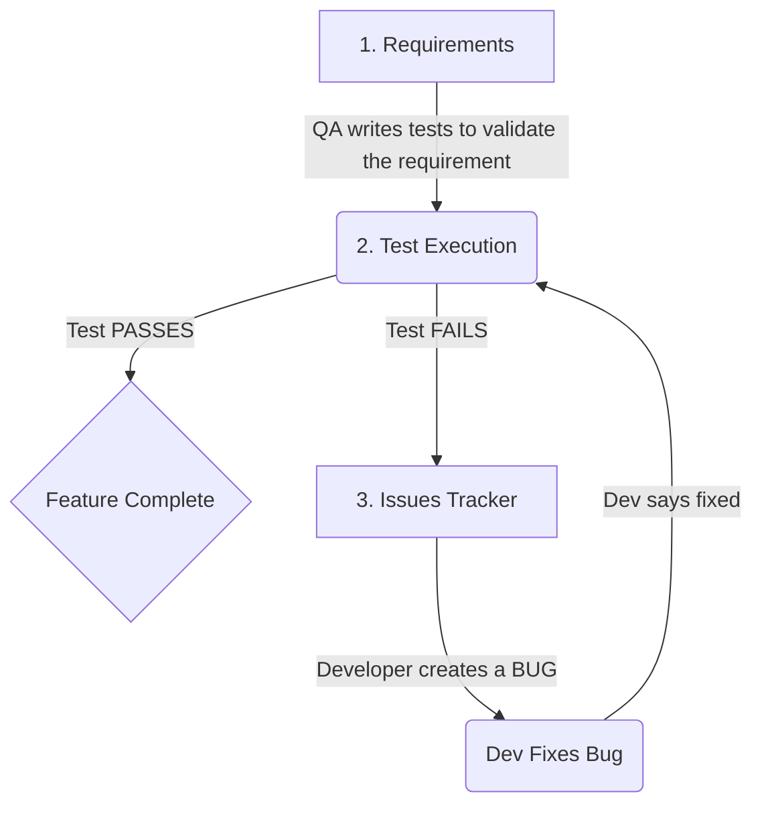

# Understanding the InitPhase Flow: Requirements, Tests, and Issues

It is completely normal to feel confused about the overlap between Requirements, Tests, and Issues. In enterprise software development, knowing exactly *what* each module does (and how they feed into each other) is the key to a clean workflow.

Here is a breakdown of how these three modules interact in your specific Software Development Life Cycle (SDLC).

---

## 1. Requirements Module (The "What")
**Purpose:** This is your contract or blueprint. It strictly defines *what* the software must do. It is usually written by Product Managers or Business Analysts.

- **Analogy:** "Our house must have a front door that locks securely."
- **Example:** "As a user, I must be securely authenticated before proceeding to payment."
- **Focus:** Future-oriented. "We need to build this."

---

## 2. Test Execution Module (The "Validation")
**Purpose:** This is your Quality Assurance (QA). It proves whether or not the developers actually built the *Requirements* correctly. Tests are strictly mapped 1-to-1 against existing Requirements. 

- **Analogy:** "Let's physically try to push the front door open when it is locked."
- **Example:** "Test Case: Enter invalid password on the login screen. Expected: Access Denied."
- **Focus:** Present-oriented. "Does the thing we built actually work?"

---

## 3. Issues Module (The "Action Items")
**Purpose:** This is your day-to-day operations hub (like Jira). It tracks bugs, general tasks, and enhancements. It exists to track *who* is fixing *what*.

- **Analogy:** "The lock is broken! Call the locksmith to fix it by Tuesday."
- **Example:** "Bug: Authentication token expires too early on Safari." or "Task: Rotate API keys."
- **Focus:** Action-oriented. "Who needs to do immediate work today?"

---

## 🏗️ The Flow and Interconnection (How they work together)

Here is exactly how data and workflow should move between these three modules during an active project:

### The Scenario Walkthrough
1. **(Requirements):** You log a requirement: *"Users need to upload profile pictures."*
2. **(Test Execution):** The QA engineer logs a test against that requirement: *"Try uploading a 10MB PDF instead of an Image."*
3. **(Test Execution):** The QA engineer runs the app, uploads a PDF, and the app crashes! The QA marks the test status as **FAILED**.
4. **(Issues):** The QA engineer goes to the **Issues Module** and logs a new Bug: *"App crashes when uploading PDF. Assigned To: Frontend Dev."*
5. **(Issues):** The Frontend Dev sees the Issue, fixes the code, and marks the Issue as **Resolved**.
6. **(Test Execution):** QA runs the upload test again. It doesn't crash this time. QA marks the Test Execution status as **PASS**.

### Summary
*   **Requirements** define the goal.
*   **Tests** check if you hit the goal.
*   **Issues** are the tasks created when you miss the goal, or need to assign daily development chores.
